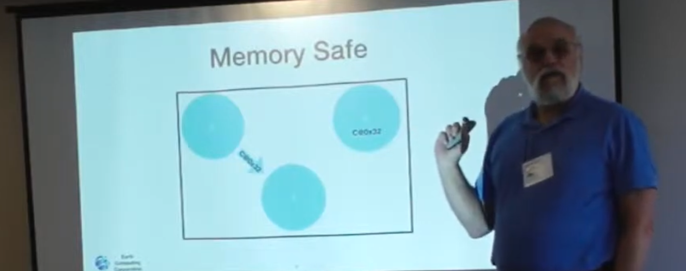

## Unforgeable Distributed Capabilities
- A capabilitiy is a transferrable unforgeable permission to use the thing it
-
- ## Permission vs Authority
	- #### May vs. Can
		- Authority and permission are two distinctly different concepts. (They seem to be used interchangable. I admit that I am more than likely guilty of this but now that I'm informed
		- Authority is *may* - The rules as *written* down.
		- What can be caused to happen.
	- 
- ## Not memory Safe
	- If there are no bi
	- 
- =§
-