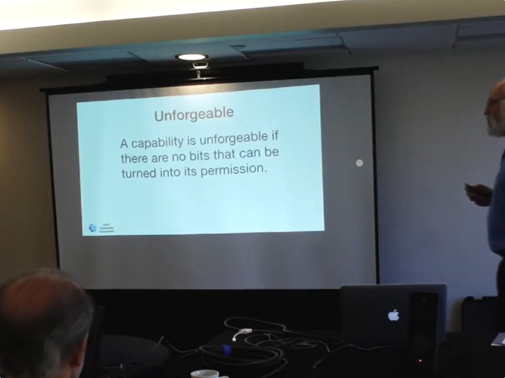

## Unforgeable Distributed Capabilities
- A capabilitiy is a transferrable unforgeable permission to use the thing it
-
- ## Permission vs Authority
	- #### May vs. Can
		-
		- Authority is *may* - The rules as *written* down.
		- What can be caused to happen.
	- 
- ![image.png](../assets/image_1699859687311_0.png
-