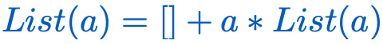

## Functional Programming with Categories #Books #[[Functional Programming]]
	- > “It is common in math to give recursive (inductive)  definitions for things.”
	- > In practical terms giving recursive definitions means that we can  progressively compose more complex entities out of simpler objects by applying some  operations between them.
	- ## Algebraic Data Types
	- ### List
		- Definition
			- A list is either....
				- an empty list
				  logseq.order-list-type:: number
				- a concatenation of an element and a list.
				  logseq.order-list-type:: number
		- Algebraic Definitio
			- 
		-
		- {{renderer :mathlive_658cc263-5860-4fe8-86bf-bc9ceee174c2}}[:div {:is "mathlive-658cc263-5860-4fe8-86bf-bc9ceee174c2"}
	- ### 3 most pervasive way to combine structures
		- Product Composition
		  logseq.order-list-type:: number
			- Most general object.
			  logseq.order-list-type:: number
			- . The product must be both A and B and must be the  least thing containing both those elements.
		- Coproduct Inheritence
		  logseq.order-list-type:: number
		- Recursive Type Inheritence
		  logseq.order-list-type:: number
	- #### Logic
	- ### Pattern Matching
		- A functional way to extract values [out of data types].
		-
- ## [[Design Patterns]]
	-
	-