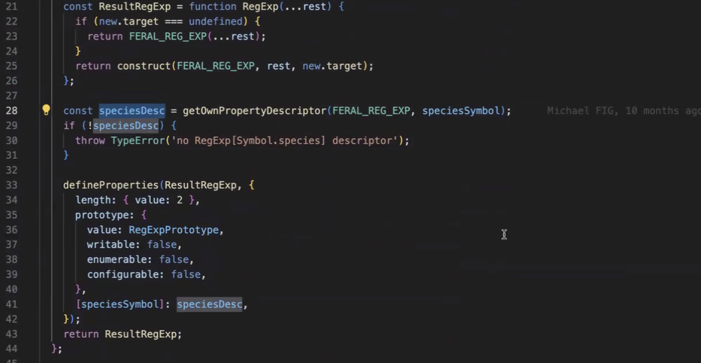
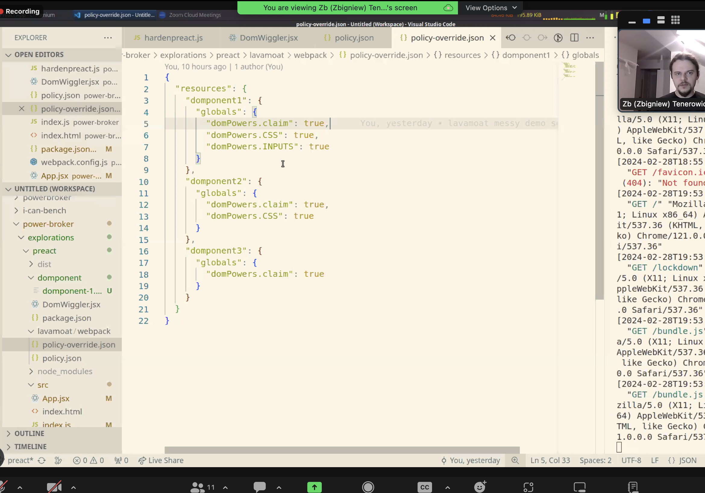
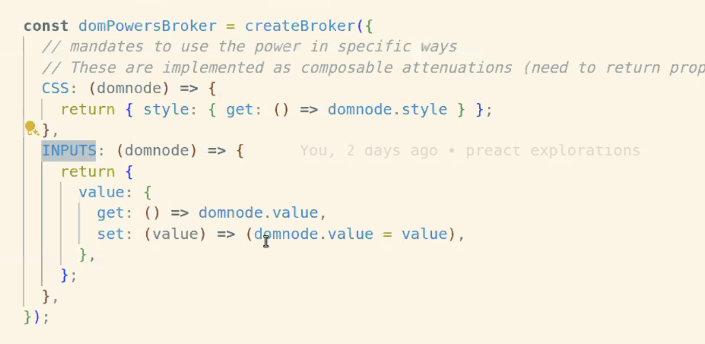

### Endo Meetings
collapsed:: true
	- Logan's run
	- ## Leo
		- `Symbol.speices`
			- Regex taming
			-
	- 
	- ensuring that species description gets transferred.
	- making the defined property conditional on
	- in hermes, Symbol.spieces is omitted.
	- **Kris K**
		- introduce a pattern for vetted shims.
	- Async functions are not supported in hermes. It throws on the syntax.
	- React-native compiles code to ES5 which transforms `async...await` to `.then`
	-
	- **Why we are interested in hermes**
		- Invented a new JS engine optimized for bundle size, load time.
		- Compiled to mobile-native code.
		-
	- Markm - Does herme support generators
		- Doing a patch that adds support for async... await
		- The hard part of support for async await involves generators.
	-
	- Found this — https://github.com/facebook/hermes/blob/main/test/IRGen/es6/async-generators.js
	   
	  Richard Gibson (Feb 28, 2024, 12:31 PM)
	  https://hermesengine.dev/docs/building-and-running/
	  > Hermes is a C++14 project. clang, gcc, and Visual C++ are supported. Hermes also requires cmake, git, ICU, Python, and zip. It builds with CMake and ninja.
	   
	  Zb (Zbigniew) Tenerowicz (Feb 28, 2024, 12:36 PM)
	  shall we timebox?
	  Jasvir’s iPhone left
	   
	  Saleh (Feb 28, 2024, 12:44 PM)
	  I think there is more context here — https://github.com/facebook/hermes/issues/1208
	-
	- ### ZB
		- Power Broker
			- A solution to DOM confinement
			- Only the first 2 components have access to the CSS.
			-
			- 
			- ### Preact.js
				- React.js is very hard.
				- Only needs ReactDOM.render.
				- If we have implicit powers that are passed around, then the `claim` function lets us capture the power.
				- \
			- Reyling on WeakMap and availability of global references.
	-
- ## Locks in JavaScript #Concurrency
	- During a heated discussion, a team uses a rubber chicken.. The person holdiing the chicken is the only person who is allowed to talk.
	  logseq.order-list-type:: number
		- If you don't hold the chicken then you can not speak.
		  logseq.order-list-type:: number
			- You **can** indicate that you want the chicken, and wait until you get it back before you speak.
			  logseq.order-list-type:: number
		- Once you have ffinished speaking, you can hand the chicken back to the moderator who will hand it to the next person to speak.
		  logseq.order-list-type:: number
			- This ensures that people do not speak over eac other.
			  logseq.order-list-type:: number
			- Each person hs their own space to talk.
			  logseq.order-list-type:: number
-