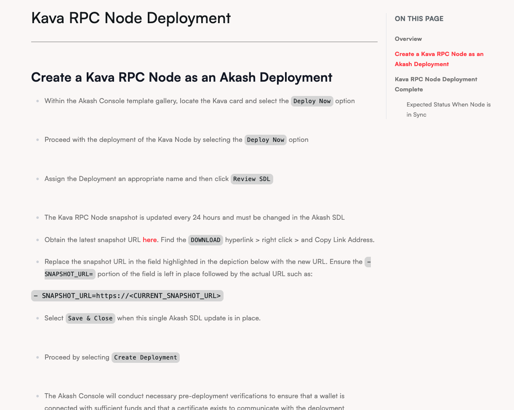

## Docs Feedback - December 10th
- Odd spacing
  logseq.order-list-type:: number
	- The image below shows an example of what I believe to be oddly spaced content. It seems as though different list items have varying padding and margin values. I'm not sure if this is the issue but if it is, can we make this uniform?
	  logseq.order-list-type:: number
	- 
	  logseq.order-list-type:: number
	- logseq.order-list-type:: number