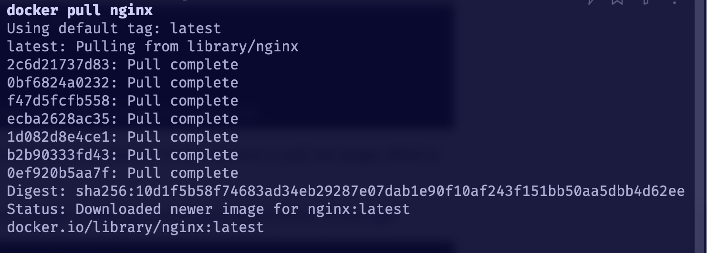

# Educative Courses
	- ## Working with Containers #Docker
	  collapsed:: true
		- #### Why Docker
			- Isolation from the main system
				- if you are testing asyncio support for one application that needs Python 3.7, and you decide not to use it, you might need to uninstall Python 3.7 and install the previous version. With Docker, you simply remove the container
			- Configurations
				- There are a lot of different configurations required for every project. Maintaining a list of configurations is very difficult. Docker provides the capability to configure images with different configurations and tag images.
			- Industry Demand
				- As Docker promises an equivalent environment in both development and production, companies don’t have to test applications twice in different environments
		- #### Life before Docker
			- Dependency Matrix
				- Whatever software is built on top of any runtime or platform with a specific version of a language, having the same version installed on a system can be a challenge.
			- Time-consuming Migrations
				- As soon as the software is migrated to the new environment, managers, developers, and the system administrators used to start hunting the bugs produced because of a new environment. One question that was frequently asked was “What is the difference between this environment and the last environment where everything worked fine?”
			- > Docker fixes the age-old scenario of “It works on my machine”
			  **18:15** [[quick capture]]:  :4bfkpc8ox
	- ## Docker Architecture
	  collapsed:: true
		- > “Docker provides the ability to package and run an application in a loosely isolated environment called a container. The isolation and security allow you to run many containers simultaneously on a given host. Containers are lightweight because they don’t need the extra load of a hypervisor, but run directly within the host machine’s kernel. This means you can run more containers on a given hardware combination than if you were using virtual machines”. - Docker’s Official Documentation
		- ### Image
			- The docker image is the **blueprint of the container that it creates**.
			- A container is an instance of the `Image` class so `const container = new Image()`
		- 
		- ### Containers
			- **A container is an instance of an image, which simulates the required environment with the use of the Linux kernel packaged in it.**
			- In the diagram, you can see app B is enclosed in one container. Similarly, you can enclose the other two apps as well.
		- ### Why this is useful
			- Containers give us a tool for creating systems with limited overhead.
				- Limited Overhead - A container that installs node v18 does not come coupled with a bunch of additional applications binaries, etc. that you would otherwise find on an operating system. **This results in software systems comprised of images which hold only the software they need to accomplish their goals and nothing else.**
			- This container can then be used alongside other containers to function as one coherent system made up of **isolated units of code.**
			- #### From the course
				- > So, if you fetch a Python 3.5 image from Docker and run an instance of it, you can do whatever you were able to do in the host machine using a command line interface. If you make any mistake with that instance, you can delete the container and create a new one from the existing image. This way, your main environment remains intact in the form of an image and you can play around with the dependencies packaged in the image using containers.
				-
	- ## Docker Architecture (Continued)
	  collapsed:: true
		- #### Docker Ecosystem
			- Docker Registry
			  logseq.order-list-type:: number
				- Maintains all of the images in the registry.
				  logseq.order-list-type:: number
			- Docker Hub
			  logseq.order-list-type:: number
				- The repository for custom-built images.
				  logseq.order-list-type:: number
			- Docker Client
			  logseq.order-list-type:: number
				- The CLI tool used to interact with the Docker server (Daemon)
			- Docker Daemon
			  logseq.order-list-type:: number
				- The Docker server process responsible for pulling, pushing, building, and running images
				  logseq.order-list-type:: number
				- ##
				  logseq.order-list-type:: number
		- ### Communication between Docker client <—> Docker Daemon
			- **The process of using the Docker client (CLI) to run a particular images executes as followed:**
				- If it finds the image, it will run the container forked from that image.
				- If the image is not present on the system, it will pull the image from the Docker registry and create a container from the image.
			- #### Docker Client
				- The docker client **can be used to communicate with the Docker daemon present on he host** machine or **any remote daemon as well.**
				- Conclusion
					- Most of the time, docker users only have to be mindful of
						- Images
						- Containers
						- Networks
					- The rest is left for Docker to take care of.
					-
		- ## Layers
			- A docker image consists of layers. These layers are **responsible for housing any dependencies that a given image needs to function.
			- #### Example - `docker pull nginx`
				- The screenshot below shows the layers that nginx requires in order to function properly
					- 
			- **Layers can be shared across images.**
				- Docker caches intermediatary layers to speed up the image building process.
				- {{video https://www.icloud.com/attachment/?u=https%3A%2F%2Fcvws.icloud-content.com%2FB%2FAdFZ0Vqc3x6P3iZj922zkiZptNTfARSqziW7VvDgm5THuH1vDPz1ag3W%2F%24%7Bf%7D%3Fo%3DAvt-rtHKscAfw3Lk3Bl13HO_eWt0jsMUr0xJN_ufGKJq%26v%3D1%26x%3D3%26a%3DCAogREzQtulyxTvJ2hSJ9SUP21JMjSVctnoxoRWrjZhAOCkSbRDgneG0xDEY4K3ciM4xIgEAUgRptNTfWgT1ag3WaiZgSw9Mv1W1PGpFsxYTMCoLAP3OfZkYgfF-9ukVeatFNQiGmpkB2XImZygqRByY2wFy-OpC35Efh_3UN1JlIkvbBvm4gwgBPvfXkrHMUPQ%26e%3D1704583436%26fl%3D%26r%3D24E05676-3C0B-4BDF-A1A1-23AB2E2682E7-1%26k%3D%24%7Buk%7D%26ckc%3Dcom.apple.clouddocs%26ckz%3Dcom.apple.CloudDocs%26p%3D137%26s%3DZfk2mFNoWtpDh--ddDztai1d_qA&uk=2N8sdma-t2JQUVM_3irBmg&f=docker-pull-recording.mp4&sz=738754}}
			-
			- ## Docker CLI
				- On the CLI and layers... #card
					- **ONLY RUN, COPY, and ADD CREATE LAYERS** #card
				- #### `docker run -it <image-name> <command-to-execute>` #card
					- `-i` runs container in *interactive* mode. #card
					- `-t` creates a pseudo terminal for us. #card
				- #### `docker ps`
					- Lists active (running) containers.
					  collapsed:: true
						- **Running this with the `-a` flag **show all containers, regardless of their current status.**
					- Command showing **running
						- *CONTAINER ID*: shows the unique ID of each container
						- *IMAGE*: the image from which the container is created
						- *COMMAND*: command executed in the container while starting it
						- *STATUS*: the current status of the container
						- *PORTS*: if any of the container ports is connected to the host machine, it will be displayed here
						- *NAMES*: this is the name of a container. If it is not provided while creating the container, Docker provides a unique name by default.
						- *CREATED*: the time the container was created
			- ### Committing updates to a Container
				- #### What we did
					- `Docker start <image-id>`
					  logseq.order-list-type:: number
					- `Dodcker exec -it <image-id> bash`
					  logseq.order-list-type:: number
						- Initiates a new shell for us using bash.
						  logseq.order-list-type:: number
						- [Warp subshells](https://docs.warp.dev/features/subshells)
						  logseq.order-list-type:: number
					- Added `nano to our project`
					  logseq.order-list-type:: number
						- `apt update && apt install nano`
						  logseq.order-list-type:: number
					- Created a python file using nano.
					  logseq.order-list-type:: number
						- Displays the day’s date.
						  logseq.order-list-type:: number
						- Wrote a `main.sh` file that executes the `todays_date.py` file.
						  logseq.order-list-type:: number
					- **Used `docker commit` to commit to add the changes to our container**
					  logseq.order-list-type:: number
						- @@html: <iframe src="https://app.warp.dev/block/embed/9gyOk5CKHqY8VrtDSBEXvp" title="initial-docker-commit" style="width: 1662px; height: 207px; border:0; overflow:hidden;" allow="clipboard-read; clipboard-write"></iframe>@@
						  logseq.order-list-type:: number
					- `docker tag`
					  logseq.order-list-type:: number
						- The tag of an image Is used to refer to the
						  logseq.order-list-type:: number
						- @@html: <iframe src="https://app.warp.dev/block/embed/aHPVGwfxYK3IJ1RyPDEZhq" title="embedded warp block" style="width: 1662px; height: 188px; border:0; overflow:hidden;" allow="clipboard-read; clipboard-write"></iframe>@@
						  logseq.order-list-type:: number
					- `docker push`
					  logseq.order-list-type:: number
						- `docker push <your_docker_hub_username>/<image>:<version>`
						  logseq.order-list-type:: number
						- @@html: <iframe src="https://app.warp.dev/block/embed/2x8WT8KHMhAZm5mu9safXL" title="embedded warp block" style="width: 1662px; height: 416px; border:0; overflow:hidden;" allow="clipboard-read; clipboard-write"></iframe>@@
						  logseq.order-list-type:: number
			- #### Common commands
				- `docker pull <image-name><verion?>`
				- `docker run <image-name><verion?>`v
				- `docker ps`
				- `docker ps -a`
				- `docker create volume`
			- ### Key Points & Themes
				- **Docker uses the Linux kernel for containers.**
		- ## Working with Containers
			- ### CLI
			- `docker run && docker exec -it <container-that-was-just-run>`
			  logseq.order-list-type:: number
				- if a container is stopped, then it first needs to be run.
				  logseq.order-list-type:: number
				- **avoid the mistake of unknowingly working in the wrong container ``
				  logseq.order-list-type:: number
	- ## Managing Data (Volumes)
	  id:: 65741d2d-4d62-41d4-9510-c4d7eaccd043
		- to access the host files in the container for faster access to data and while coding as well, because you cannot code, build, and then check your code.
		- > Docker volumes are mostly created to share data within different containers, rather than sharing data with host and container.
		- ### Bind mount
			- Bind mount allows you to use the **host file system and mount it on the container**. #card
			- #### Mounting a volume from my machine to an image when starting a container #essentials
				- Example:
					- command
						- `docker run -it -v ./Desktop/Docker_Volumne_Example:/desktop date_project:1.0`
					- result:
					- After mounting this directory, we will see it appear within our container as the name “desktop”.
			- ### volume commands #essentials
				- `docker volume --help`: to get the volume help
				- `docker volume create`: to create a new volume
				- `docker inspect` volume: to inspect the created volume
				- `docker run -v:` to mount a volume
				-
- ## Docker Fundamentals
	- ### Recurring Theme
	- > **Docker is Linux for containers.**
-