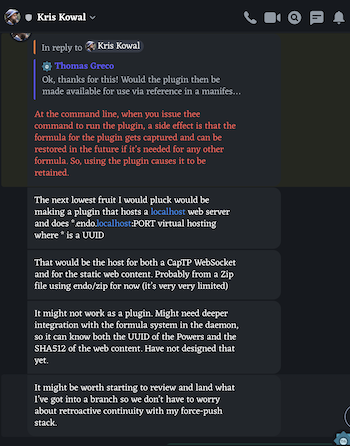

- {:height 505, :width 432}
- The next lowest fruit I would pluck would be making a plugin that hosts a localhost web server and does `*.endo.localhost:PORT` virtual hosting where * is a UUID.
- That would be the host for both a CapTP WebSocket and for the static web content. Probably from a Zip file using endo/zip for now (it's very very limited) It might not work as a plugin. Might need deeper integration with the formula system in the daemon, so it can know both the UUID of the Powers and the SHA512 of the web content. Have not designed that yet.
- ## Frontend App
- Construct a message port
	- `MessagePort`
	- Webs equivalent of a UNIX pipe (instead it speaks in terms of structured clone).
	- It frames messages.
- Message Port gives you a reader and a writer.
	- postMessage to send the otherside of the message port elsewhere.
-