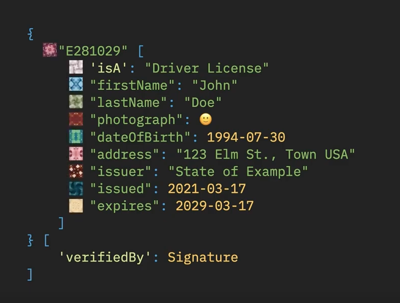
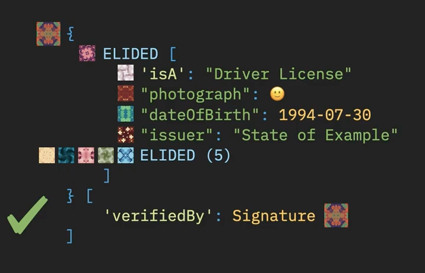
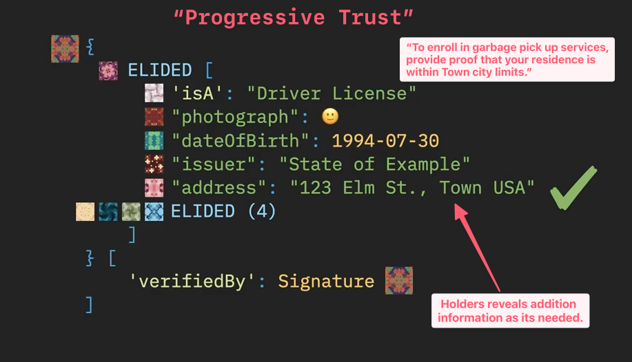

## The Envelope Metaphor
	- Universally understood
	- Overlooked Properties
		- Envelopes can hold information on their exterior.
			- We often think of envelopes as simple document containers, and we overlook the fact that **we can write on them.**
			- Envelopes hold documents, however, they are documents themselves.
			- They are extremely versitile, and can be used to send:
				- senstive information
				- payments.
				- additional envelopes!
			-
		- Gordion Envelops
			- Hash Algorithms
			- Elision and Redaction
			- Determinism
			- dCBOR (Deterministic CBOR)
		- #### Hash Algorithms
			- Hash functions take an input of any size called the **image**,
			- Produce a fixed-size string of characters called a **digest**
				- sha256 always produces outputs of 256 bits.
			- Deterministic
				- Same input produces same output.
				- Avalanche Effect - Big changes in output from small changes in put
			- Can you reverse the process and use the digest to find the input?
				- NO!
				- This is known as **pre-image resistance**
			- Can you find a different image that produces the same output?
				- NO!
				- This is known as **second pre-image resistance**
		- ### Elision
			- Redaction is the process of
			- Elision is the process of
			- Not soley for privacy and security.
			- Can be used for redaction, but this is not the only use case.
			- Gordion documments make it extremely easy for users to elide information.
			- The holder can elide parts of the document that have been previiously signed without corrupting / invalidating the signature.
			- ### Elision in Gordion Envelopes
				- The image below shows contents of a gordion envelope
					- {:height 253, :width 324}
				- Every part of a gordion envelop is a node in a tree.
				- Every node is the tree has a unique digest.
				- #### The characteristic digest
					- The root of the tree represents the evenlope as a whole.
					- It is this digest that is signed.
					- #### Eliding Data
						- When parts of a gordion envelope are elided , the information itself is removed, but the digest remains the same,
						- The recieve can verify that the signature is valid without knowing that everything is signed.
						- 
						- At a later date, the holder of the envelope can reveal additional information.
						- 
						-
					-
				-
			- Progressive Trust
				- The process of