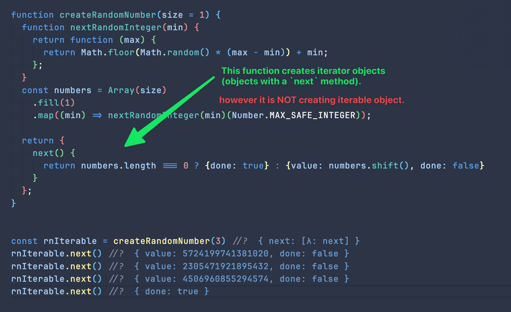
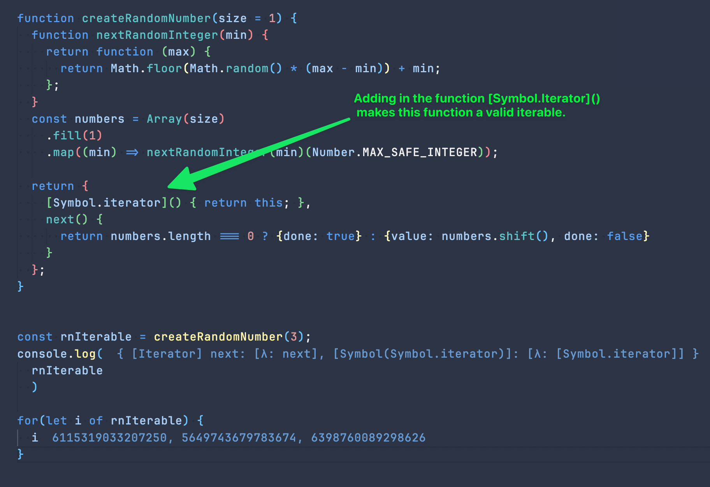

- ## Iterables
- An iterable is an object whose elements (or properties) can be enumerated or looped over.
- The **iterable protocol** allows you to customize the iteration behavior of your objects when they appear inside a `for...of` construct or are used with the `spread` operator
- Native Iterable Objects
	- Array
	- Map
	- Sets
	- Strings
- **An Iterable does not do much without its iterator**
- An iterable object...
	- defines its own `Symbol.iterator`, used to control how these elements are delivered to the caller.
- ## Iterator
- The **iterator** is the contract that’s presented to the language runtime when iteration behavior is required.
- JavaScript expects an object to contain a **next method**.
- **next()** returns objects with the following properties:
	- **done**
		- Indicates whether there are more elements.
		- A value of false tells the JavaScript runtime to continue looping.
	- value
		- Contains the value bound to the loop variable.
		- This value is ignored when done is equal to true, and the sequence terminates
- ## Examples
- ### `randomNumberIterator`
	- `randomNumberIterator` **conforms to the `iterator` interface, however it is not an `iterable`.**
		- **iterator interface**
			- It implements `next()` which returns an object containing `value` and `done`.
	- 
	-
- ### `randomNumberIterable`
	- to transform `randomNumberIterator` so that it is an `iterable`, we simply need to add a `[Symbol.iterator]` function.
	- 
	-