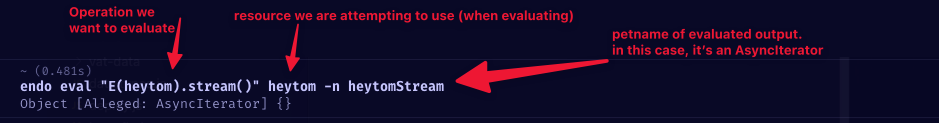
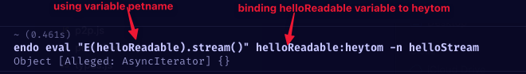
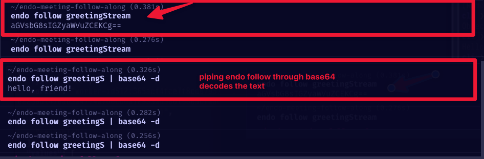
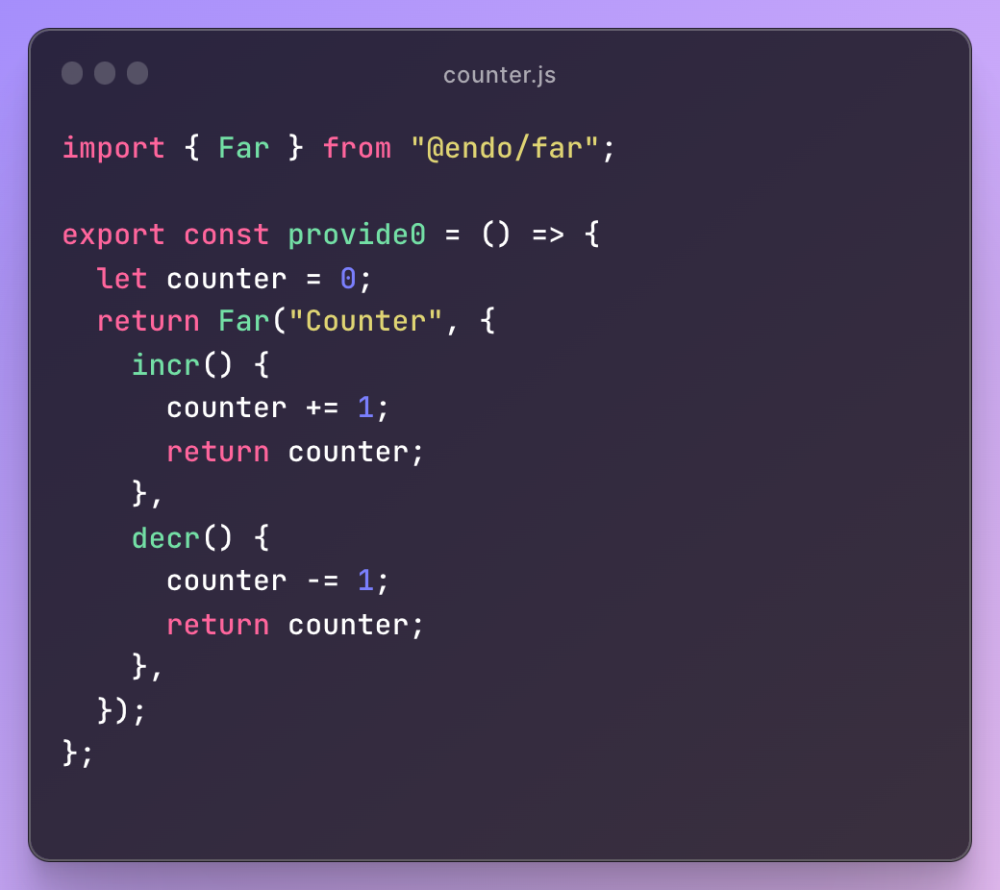
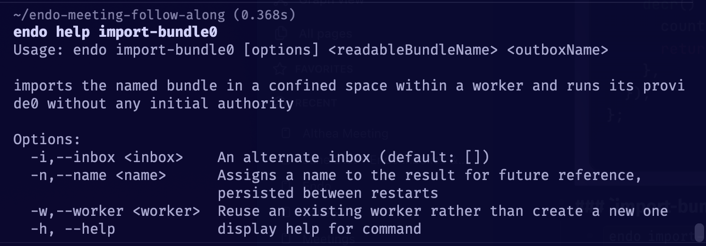
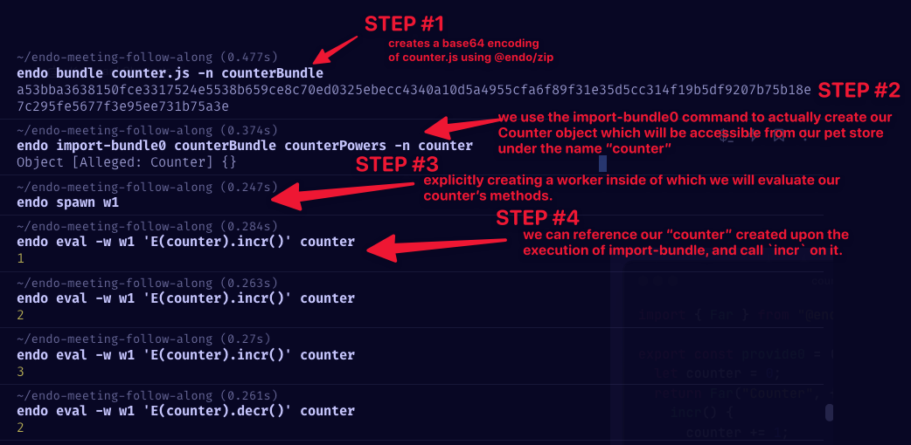

- An entangled pair of objects
	- Inbox - user holds to grant/deny access to powers requested by the party holding the outbox.
- 4 mins
	- Endo commands start
- Comment from Kris on cutting down the available options `endo` shows when executed or more likely **creating a sub-command hierarchy.**
- Endo petname with hyphens don't seem to work?
-
- What does "over the wire" mean
	- Context -UInt8Arrays cant go over the wire, so we need to use an #Base64 Stream.
	- Can't currently marshal UInt8Arrays
- ### Endo `follow`
	- prints a representation of each value from the named async iterable as it arrives.
-
- {:height 83, :width 574}
- 
-
- Mathias
	- Question where Endo differs from Service workers.
	- With service workers, if you have something exported by a program that gets terminated, then that things that gets exported is severed. the reference is no longer useful.
	- in Endo when you restart, the helloStream is a heap capability that exists when you restart.
	- It's not that it still exist, but it has instructions for recreating.
- Each time Endo execution takes a place, a new compartment is created
- There is a compartment created each time execution takes place.
- Any intermediate messages that would have to be replayed (in the case of a vat) can be garbage collected instead of having to persist a log.
- Referencing recreation of Endo objects - Opportunity to go purely functional
- Formulas
	- each file in this directory captures the instructions for reconstructing it based off of the interactions.
	- it replays the DAG of
- signifgance of `0`
	- hedge against something that is going to change.
	- ex. `import-bundle0`
- ## `base64` vs `sha-512`
- 
-
- ## counter examples
- ### Maker vs. Provider
	- Dan calls out that this function looks like a maker function, not a provider.
	- This function creates a new function every single time it is called.
- ### Bundling
-
- 
- ### `import-bundle`
- creates an object as well as its powers.
- 
- The side-effect of  `import-bundle` is the creation of an *outbox*.
- 
- ## Inbox vs Outbox
- Inbox
	- Look at your pending request
- Outbox
	- Object that you grant to the other party.
- ### Formulas
	- each file in this directory captures the instructions for reconstructing it based off of the interactions.
	- it replays the DAG of
-
- tags:: [[Endo]], [[Endo Meetings]]