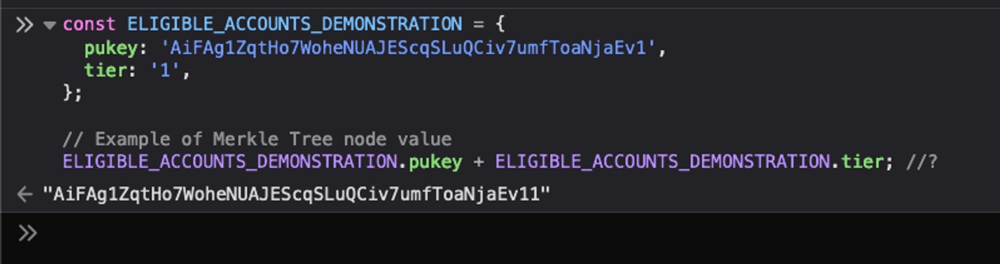

## The Eligibility Tree
	- The Eligibility Tree is a Merkle tree that serves as the single-source of truth for all eligible claimants.
	- Each node in the tree holds the public key associated with an account that has been marked as eligible.
	- In addition to the public key value, there will be an additional character concatenated onto the end of the public key value, which will signify the tier that associated with that particular public key.
		- 
	- Each individual in possession of a public key  a node will be provided with a proof corresponding to the position of their public key within the eligibility tree.
- ### Claiming $TRBL with `makeClaimInviation`
	- The contract exposes an invitation maker, `makeClaimInvitation`, via its `publicFacet`. When a user attempts to claim, an offer will be made using this invitation.
	- In order for the offer to work properly, it must fulfill the following requirements:
		- Contains a `Proposal` with the shape `({ give: oneIST }) `
		  logseq.order-list-type:: number
		- Contains a `Payment` containing 1 $IST.
		  logseq.order-list-type:: number
		- Provides the following values as `offerArgs`:
		  logseq.order-list-type:: number
			- public key - The public key belonging to the account attempting to claim.
			  logseq.order-list-type:: number
			- proof - The validity proof associated with the user's public key.
			  logseq.order-list-type:: number
			- walletAddress - The wallet address derived from the user's public key.
			  logseq.order-list-type:: number
	- ### `offerHandler`
		- When the offer is submitted, the contract will process the `offerArgs` data to verify the `proof` against the `merkleRoot` value passed into the contract at start time.
		- compute the hash, to compute a hash, which will then be compared to the hash of the Merkle tree or the Merkle root.
		- If successful, then the contract will create a Payment containing a token amount computed previously via the incremental decay process.
		- #### Bookkeeping
			- The claimants public key is stored as keys within the `Set` object for that particular epoch. When a claim is initiated, a lookup is done on each `Set` for the purpose of eliminating any chance of an eligible account successfully claiming any more than once.
			- This `Set` also plays a role in the bonus mint process (described below)
		- ### Bonus Mint Process
			- If during an epoch, the target number of claims is reached, then a portion of the `bonusSupply` is transferred to the `baseSupply` seat.
			- Example Scenario:
				- Setup:
					- The Tribble Airdrop's will remain open for a total of 5 epochs. Each epoch will span 24 hours.
					- The base supply of tokens is 10 million tokens.
					- The bonus supply is 500k tokens.
				- Mechanism
					- 12 hours into the epoch, the target claim number is reached causing 20% of the bonus supply, or 100,000 $TRBL tokens, to enter into circulation.
					- From this 100k $TRBL tokens, 50k are distributed to claimants whos actions led to this target being reached.
					- This process entails iterating over each key in the `Set` associated with the current epoch.
					- During each iteration, the claimant's wallet address accessed for used with the `namedByAddress` naming service to directly deposit the retroactive payments to each account.
					- The remaining 50k is then added to the `baseSupply` to be distributed amongst all tiers, resulting in a bump in the number of tokens allocated to claimants that come afterwards.
- ## Contract Start
	- This section discusses the arguments that are passed into the system’s `ContractStartFn`.
		- ### `customTerms`
			- `tiers`
				- The Airdrop Tiers object is used to determine the maximum number of tokens that an eligible user can claim across each epoch.
			- `epochLength`
				- The duration of each epoch, denominated in seconds.
			- `baseSupply`
				- The minimum number of $TRBL tokens that eligible users will have the ability to claim.
			- `bonusClaimTarget`
				- The number of claims which must take place within an epoch in order for a “bonus mint” event to take place.
			- `bonusSupply` -
				- A set of $TRBL tokens that can be added to the internal contract seat holding the `baseSupply` in the event that a `bonusClaimTarget` is reached.
			- `startTime`
				- A relative timestamp used during the setup phase of the contract.
				- During the setup, the Agoric blockchain’s `chainTimerService` is used to obtain an absolute timestamp, and this timestamp is then added together with the `startTime` value.
				- The result of this addition is a future timestamp which is used internally to setup a  `TimeWaker` that is responsible for transitioning the contract code from the “prepared” state to “claim-window-open” state.
			- When the contract transtions into an “open” state, the claiming window is con
			  
			  ```
			  const AIRDROP_TIERS = {
			  0: [1000, 800, 650, 500, 350],
			  1: [600, 480, 384, 307, 245],
			  2: [480, 384, 307, 200, 165],
			  3: [300, 240, 192, 153, 122],
			  4: [100, 80, 64, 51, 40]
			  };
			  
			  const contractStartTerms = {
			  tiers: AIRDROP_TIERS,
			  epochLength: TimeIntervals.SECONDS.ONE_DAY,
			  bonusSupply: 100_000n,
			  baseSupply: 10_000_000n,
			  startTime: relTimeMaker(TimeIntervals.SECONDS.ONE_DAY * 3n),
			  };
			  ```
		- ### `privateTerms`
			- `namesByAddress`
				- The `namesByAddress` name service will be used to send airdrop payments to users by way of their agoric address.
			- `chainTimerService`
				- The TimerService that will be used internally by the contract for the purpose of handling all timer-based operations.
			- `merkleRoot`
				- The root of eligiblity tree which will be used to verify whether or not a user is eligible.
			- `marshaller`
				- The marshaller will be used to write values to Agoric’s  vstorage. These values range from the issuer and brand associated with the $TRBL coin.
				  
				  <!-- notionvc: f8de91bb-c414-4756-a9f6-5210026c77f4 -->
- ## CoreEval
	- In accordance with the rules of Agoric’s mainnet 2, each contract that is deployed to the Agoric blockchain must begin its existence via CoreEval script.
	- Running this script creates the framework of the smart contract system. In the case of the Tribble Airdrop Campaign, this framework requires the contracts to have the ability to add the Tribble token issuer and Tribble token brand to the `agoricNames` naming service.
	- ### Permit File
		- Whereas the `CoreEval` script builds the framework, the permit file supplies the objects required for the framework to function properly. These capabilities are referred to as the **BootStrapPowers**.
		- ```js
		  export const permit = harden({
		    consume: {
		      bankManager: true,
		      chainTimerService: true,
		      agoricNames: true,
		      namesByAddress: true,
		      namesByAddressAdmin: true,
		      brandAuxPublisher: true,
		      startUpgradable: true, // to start contract and save adminFacet
		      zoe: true, // to get contract terms, including issuer/brand
		    },
		    installation: {
		      consume: { [contractName]: true },
		      produce: { [contractName]: true },
		    },
		    instance: { produce: { [contractName]: true } },
		    issuer: { consume: { IST: true }, produce: { Tribbles: true } },
		    brand: { consume: { IST: true } }, produce: { Tribbles: true },
		  });
		  ```
- ## Epoch Decay Mechanism
	- #### Desired Properties
		- 1. **Distribution Duration**:
			- The strategy will take place over five days.
		- 2. **Even Distribution with Incentives**:
			- We aim for a distribution mechanism that avoids a sharp decrease in supply either at the campaign's start or end.
			- We also incorporate incentives to encourage early claims.
		- 3. **Token Supply**:
			- The total token supply will range from 10 to 20 million to ensure scarcity.
		- 4. **Incentivizing Early Claims**:
			- To incentivize early claims, we will include a decay rate that modestly decreases daily token allocations.
			- Additionally, a "bonus mint" event is planned to further encourage prompt participation.
	- #### Decay Factor Considerations
		- Using a decay factor of 0.85% aligns somewhat well with our focus on having a decay slope that is steep enough to motivate users to take action, but is not steep enough to end up in a scenario where a disporportionate number of tokens are allocated to a small, select number of people.
	- ### Distribution Mechanics
		- #### Step 1: Initial Token Allocation
			- We'll allocate the total token supply equally among the 5 tiers.
			- **Example Token Supply**: 15,000,000
			- **Tokens per Tier**: \( \text{Total Tokens} / 5 = 15,000,000 / 5 = 3,000,000 \)
		- #### Step 2: Calculation of Daily Tokens
			- Using the decay formula:
				- $$
				  a_n = a_1 \cdot 0.85^{(n-1)}
				  $$
			- Where \( a_n \) is the number of tokens available on day \( n \). The total allocation for each individual is:
				- $$
				  S_5 = a_1 \cdot \frac{1 - 0.85^5}{1 - 0.85}
				  $$
			- For 3,000,000 tokens distributed to 1,000 individuals in Tier 1:
				- $$
				  3,000,000 = 1,000 \cdot a_1 \cdot 3.953
				  $$
				  $$
				  a_1 = \frac{3,000,000}{1,000 \cdot 3.953} \approx 759.19
				  $$
		- #### Step 3: Tokens Claimable Each Day
			- For each tier, tokens claimable per individual:
			- | Day | Tokens (Tier 1)  | Tokens (Tier 2)  | Tokens (Tier 3)  | Tokens (Tier 4)   | Tokens (Tier 5)  |
			  |-----|------------------|------------------|------------------|------------------|------------------|
			  | 1   | 759.19           | 151.84           | 75.92            | 18.98            | 7.59             |
			  | 2   | 759.19 × 0.85 ≈ 645.32 | 151.84 × 0.85 ≈ 129.06 | 75.92 × 0.85 ≈ 64.53 | 18.98 × 0.85 ≈ 16.13 | 7.59 × 0.85 ≈ 6.45  |
			  | 3   | 645.32 × 0.85 ≈ 548.52 | 129.06 × 0.85 ≈ 109.71 | 64.53 × 0.85 ≈ 54.85 | 16.13 × 0.85 ≈ 13.71 | 6.45 × 0.85 ≈ 5.48  |
			  | 4   | 548.52 × 0.85 ≈ 466.24 | 109.71 × 0.85 ≈ 93.25  | 54.85 × 0.85 ≈ 46.62  | 13.71 × 0.85 ≈ 11.65 | 5.48 × 0.85 ≈ 4.66   |
			  | 5   | 466.24 × 0.85 ≈ 396.30  | 93.25 × 0.85 ≈ 79.26 | 46.62 × 0.85 ≈ 39.63  | 11.65 × 0.85 ≈ 9.90 | 4.66 × 0.85 ≈ 3.96    |
	- ### Bonus Mint Event
		- 1. 5% of total tokens set aside for bonuses.
		- 2. **Trigger Conditions**:
			- If a certain threshold of claims is met within an epoch, initiate a bonus mint.
		- 3. **Reward Distribution**:
			- Bonus adds 1% of the token supply.
			- Half of this 1% is distributed to users who met the claim target retroactively using the `namesByAddress` **BootStrap Power**
				- This process is as follows:
					- The contract computes the agoric address using the public key value.
					- The address is compared with the address responsible for signing the transaction.
		-
- ## Incremental Decay Mechanism
	- ### Concept
		- The incremental decay mechanism is designed to further incentivize early claims by progressively reducing the number of tokens available for each subsequent claimant within a tier. Under this mechanism, the first claimant within a tier receives the maximum token amount for that epoch, and each subsequent claimant receives slightly fewer tokens than the previous one.
		- ### Key Elements
			- 1. **Initial Distribution**:
				- The number of tokens available for the first claimant in each epoch.
			- 2. **Decay Factor**:
				- The rate at which tokens decrease for each subsequent claimant within the same epoch.
			- 3. **Resulting Token Allocations**:
				- The actual number of tokens each user receives based on their claim order.
		- ### Mathematics of Incremental Decay
			- 1. **Initial Token Amount**:
				- We'll denote \(a_1\) as the number of tokens the first claimant receives. For this example, \(a_1 = 1,000\) tokens for the first day for Tier 1.
			- 2. **Incremental Decay Factor** (\(r_i\)):
				- The decay factor \(r_i\) determines the reduction for each subsequent claim. For this example, we use \(r_i = 0.99\).
		- ### Formula for Token Allocation
			- The token amount \(a_k\) available to the \(k\)-th claimant is calculated using the formula:
			- $$
			  a_k = a_1 \cdot r_i^{(k-1)}
			  $$
			- **Where**:
				- \(a_k\) = Tokens for the \(k\)-th claimant.
				- \(a_1\) = Initial tokens for the first claimant (1,000 tokens for Tier 1).
				- \(r_i\) = Incremental decay factor (0.99).
				- \(k\) = Claimant position (1, 2, 3, ...).
		- ### Detailed Calculation for Incremental Decay
		- #### Example: Day 1, Tier 1
			- 1. **First Claimant**:
				- \(a_1 = 1,000\)
			- 2. **Second Claimant**:
				- \(a_2 = a_1 \cdot r_i^{(2-1)} = 1,000 \cdot 0.99 = 990\)
			- 3. **Third Claimant**:
				- \(a_3 = a_2 \cdot r_i^{(3-1)} = 990 \cdot 0.99 = 980.1\)
			- This pattern continues for all subsequent claimants.
				- | Claimant | Tokens Distributed (Day 1, Tier 1) |
				  |----------|-------------------------------------|
				  | 1        | 1,000 (initial)                     |
				  | 2        | 1,000 × 0.99 = 990                  |
				  | 3        | 990 × 0.99 = 980.10                 |
				  | 4        | 980.10 × 0.99 = 970.30              |
				  | 5        | 970.30 × 0.99 = 960.59              |
				  | ...      | ...                                 |
				  | 1,000    | Calculated to fit within the total allocation |
		- ### Summation and Fit within the Allocation
			- To ensure the method fits within the daily token allocation for the tier, we can use the formula for the sum of a geometric series:
				- $$
				  S_n = a_1 \cdot \frac{1 - r_i^n}{1 - r_i}
				  $$
				- **Where**:
		- \(S_n\) = Total sum of tokens distributed to \(n\) claimants
		- \(a_1 = 1,000\)
		- \(r_i = 0.99\)
		- \(n = 1,000\) claimants
		- Calculating the total tokens allocated on Day 1:
		- $$
		  S_{1000} = 1,000 \cdot \frac{1 - (0.99)^{1000}}{1 - 0.99}
		  $$
		- Given \( (0.99)^{1000} \approx e^{-10} \approx 4.54 \times 10^{-5} \):
		- $$
		  S_{1000} = 1,000 \cdot \frac{1 - 4.54 \times 10^{-5}}{0.01}
		  $$
		- $$
		  S_{1000} = 1,000 \cdot 99.99546 \approx 99,995.46
		  $$