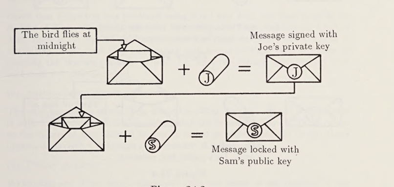
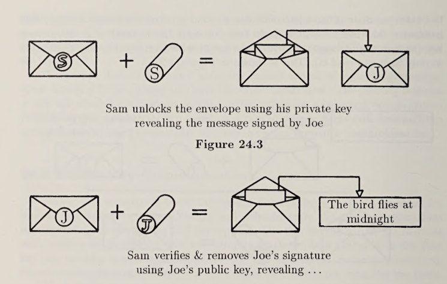

## Abstract
	- Cryptograhy is only necessary for implementing authentication operations **in the abscense of a mutually trusted secure substrate.**
	- ## Work Plan
	- Implement a public-key system that **derives security from encapsulation rather than encryption.**
	- > Concurrent Logic Programming languages provide such a substrate.
	-
	- ### Intro
		- ## 2 Issues in Security - Authorization and Secrecy
		- Capability operating systems and languages with strict encapsulation alrtleady provide this for two-party interactions. Providing secure three-party communication is more demanding.
		- 3 Party Authentication
			- passing a message through to an untrusted intermediary
			- {{rendertler :mermaid_mnj}}
				- ```mermaid
				  %%{init: { 'logLevel': 'debug', 'theme': 'forest' } }%%
				  
				  graph
				  MsgSend --> Untrusted_Intermediary 
				  Untrusted_Intermediary --> MsgRecipient
				  
				  ```
		- Three-party secrecy
			- is the ability to pass a message through an untrusted intermediary to an intended recipient in such a way that **only the intended recipient may read the message.**
		- Three party authentication
			- the ability to pass a message through an untrusted intermediary to an intended recipient so that the message contents cannot be faked while preserving the appearance of the original authorship. This corresponds to hu
		- Secrecy vs Authentication
			- Secrecy keeps the message private from others.
			- Auth refers to preserving the identity of a signature.
		- authenticated messages constitute proof to third parties that some transaction occurred.
		- The security features which are crucially important to the current approach are:
			- strict encapsulation (the ability to provide a service based on access to private data while denying that access to one’s clients), capability security, and non-forgeable unique identifiers.
	- ### Encryption via Encapsulation
		- > Cryptography has a high overhead for communication intensive computation. We describe an implemtation in Flat Concurrent Prolog using encapsulation to implement this functionality without the overhead of encryption**
	- Encryption without the Overhead
	- This doesn't depend on the log
	- The security features which are crucially important to the current approach are:
		- strict encapsulation (the ability to provide a service based on access to private data while denying that access to one’s clients), capability security
		  logseq.order-list-type:: number
		- non-forgeable unique identifiers.
		  logseq.order-list-type:: number
	- ### PK Comms
		- PK securiy based on unique key pairs that encrypt and decrept data.
		- #### Abstract Operations of Public Key Encryption
			- Sealing and unsealing are the abstract operations corresponding to encrypting and decrypting.
			  logseq.order-list-type:: number
			- Authentication is the complementary operration.
			  logseq.order-list-type:: number
		- ### How security?
			- The constraint of pre-image resistance
		- 
		- ### FCP Spec
			- `keyPair(Key1, Key2)`
			  logseq.order-list-type:: number
				- returns 2 unique keys which are each other's only inverse.
				  logseq.order-list-type:: number
				- only operation that can create a key
				  logseq.order-list-type:: number
			- `seal(Key, Msg, SealedMesg, Ok)`
			  logseq.order-list-type:: number
				- Msg is the data to be sealed. SealedMsg is an entity that can be passed to unseal with the inverse of Key to return Msg. Ok is true if the seal operation succeeds, false if it fails, and uninstantiated if it suspends.
				  logseq.order-list-type:: number
			- `unseal(Ket, SealedMsg, Msg, Ok)`
			  logseq.order-list-type:: number
				- SealedMsg comes from a seal operation. Msg is the contents that were sealed using the inverse of Key. Ok is the same as for seal. Msg will not be bound if Key is not the correct key for unsealing SealedMsg. The Ok flag indicates success rather than simply the binding of Msg so that uninstantiated variables can be transmitted as messages.
				  logseq.order-list-type:: number
		- 
		  logseq.order-list-type:: number
- The operations must satisfy the following properties:
	- Communications
	  logseq.order-list-type:: number
	- Secrecy
	  logseq.order-list-type:: number
	- logseq.order-list-type:: number
	- Authentication
	  logseq.order-list-type:: number
-
-
-
-
-
- tags: [[Object Composition]], [[Cryptography]]
- tl